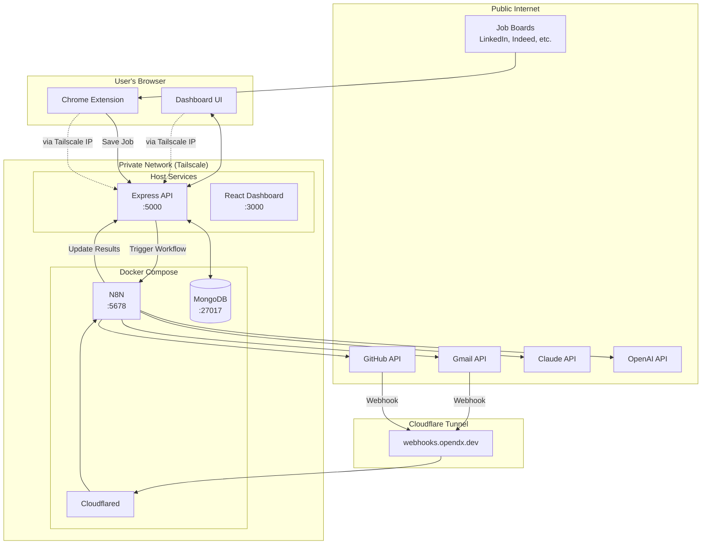
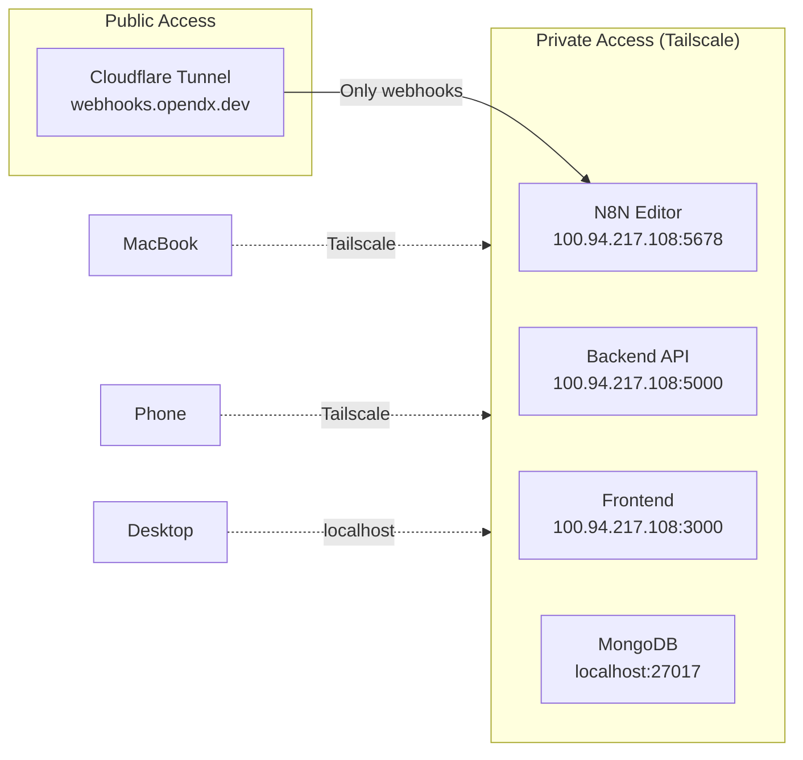
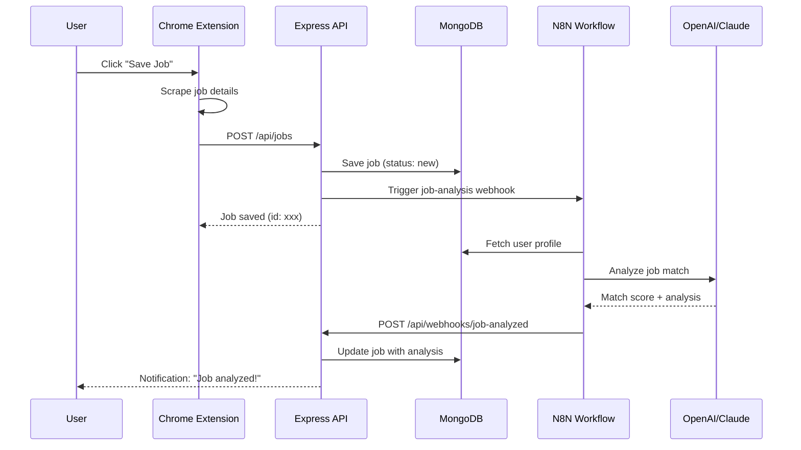
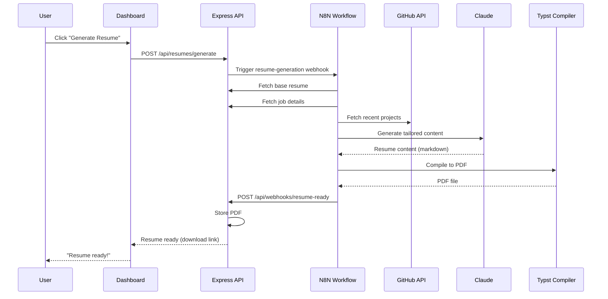
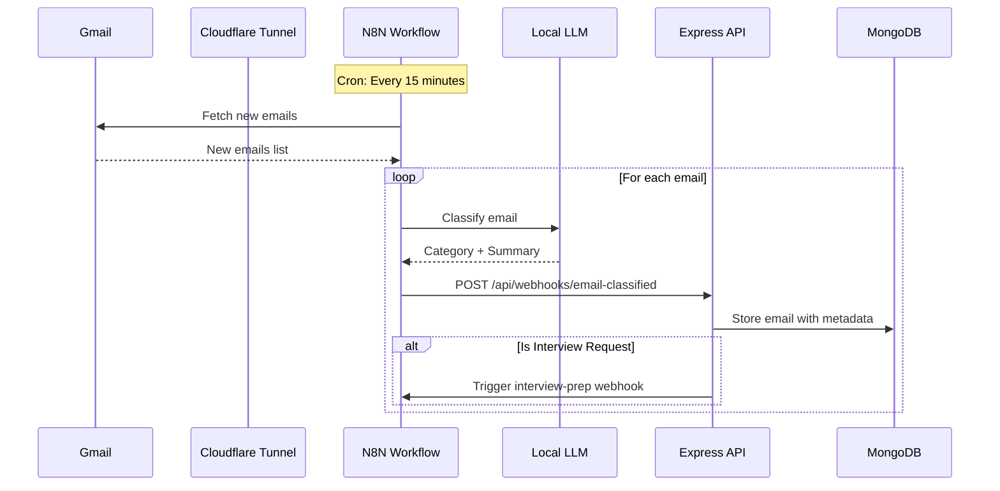
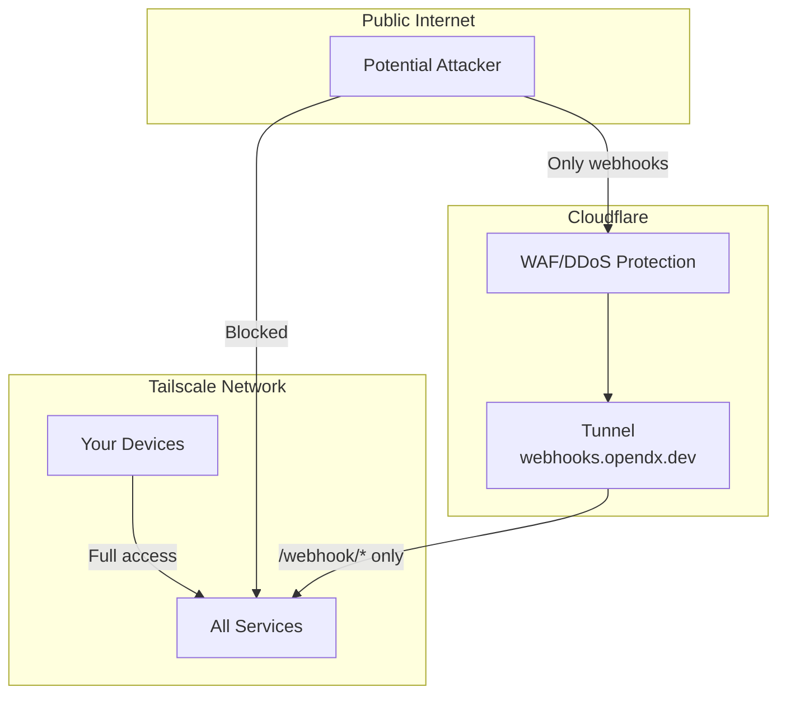
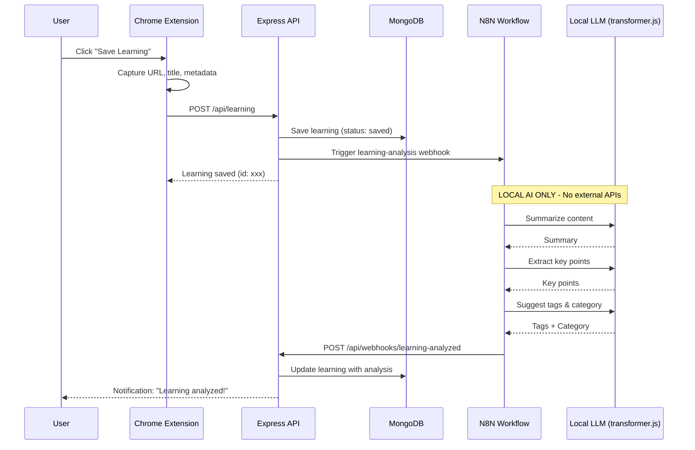
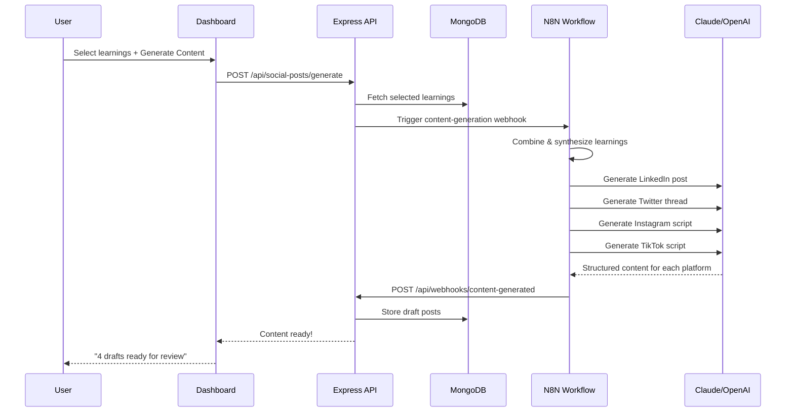
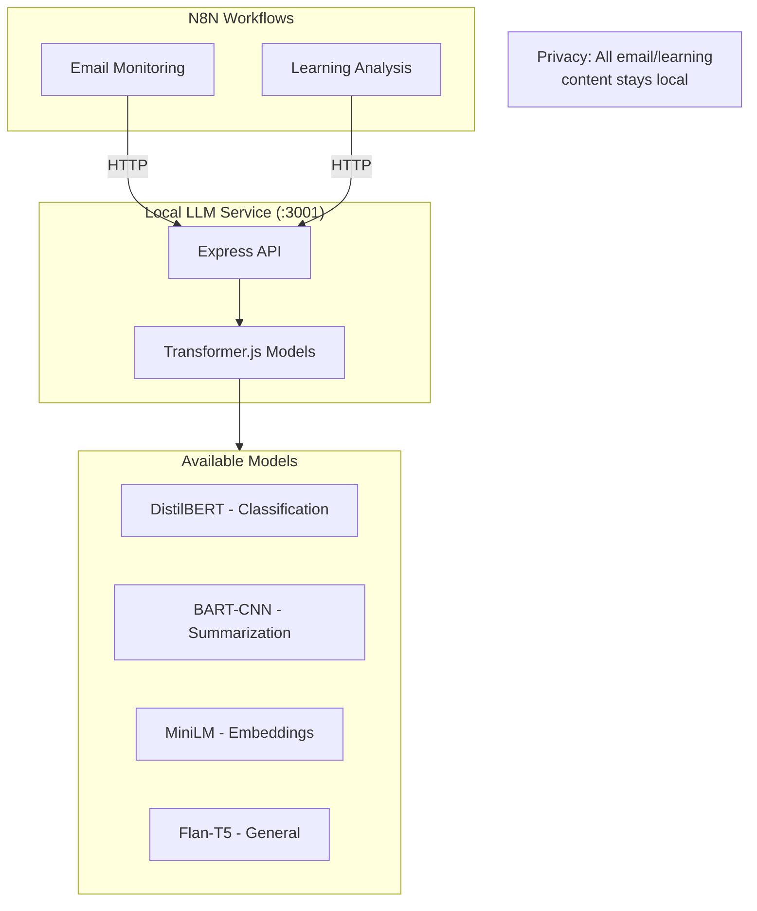

# Applyr - System Architecture

## Overview

Applyr is a self-hosted, AI-powered job application management system with three main layers:

1. **Data Collection** - Chrome Extension
2. **Automation** - N8N Workflows
3. **Management** - Dashboard (React + Express + MongoDB)

## System Flow Diagram



## Network Architecture



## Component Interaction

### Job Saving Flow



### Resume Generation Flow



### Email Monitoring Flow



## Directory Structure

```
applyr/
├── apps/
│   ├── web/                    # React Dashboard
│   │   ├── src/
│   │   │   ├── components/     # UI components
│   │   │   ├── routes/         # TanStack Router pages
│   │   │   ├── lib/            # Utilities, API client
│   │   │   ├── hooks/          # Custom hooks
│   │   │   └── stores/         # Context/Zustand stores
│   │   ├── public/
│   │   └── package.json
│   │
│   ├── api/                    # Express Backend
│   │   ├── src/
│   │   │   ├── routes/         # API route handlers
│   │   │   ├── models/         # MongoDB models
│   │   │   ├── services/       # Business logic
│   │   │   ├── middleware/     # Auth, validation
│   │   │   ├── webhooks/       # N8N webhook handlers
│   │   │   └── lib/            # Utilities
│   │   └── package.json
│   │
│   └── extension/              # Chrome Extension
│       ├── src/
│       │   ├── background/     # Service worker
│       │   ├── content/        # Content scripts
│       │   ├── popup/          # Popup UI (React)
│       │   └── lib/            # Shared utilities
│       ├── public/
│       │   └── manifest.json
│       └── package.json
│
├── packages/
│   └── shared/                 # Shared code
│       ├── src/
│       │   ├── types/          # TypeScript types
│       │   ├── schemas/        # Zod schemas
│       │   └── utils/          # Shared utilities
│       └── package.json
│
├── docker/
│   ├── api.Dockerfile
│   ├── web.Dockerfile
│   └── typst.Dockerfile        # For resume compilation
│
├── templates/
│   ├── resumes/                # Resume templates
│   │   ├── modern.typ          # Typst template
│   │   └── classic.md          # Markdown template
│   └── cover-letters/
│       └── professional.md
│
├── docs/                       # Documentation
├── .claude/                    # Claude Code context
├── docker-compose.yml
├── pnpm-workspace.yaml
├── package.json
└── .env
```

## Port Assignments

| Service         | Port  | Access                                 |
| --------------- | ----- | -------------------------------------- |
| React Dashboard | 3000  | Tailscale                              |
| Express API     | 5000  | Tailscale                              |
| N8N             | 5678  | Tailscale + Cloudflare (webhooks only) |
| MongoDB         | 27017 | localhost only                         |

## Security Model



### Access Control

- **MongoDB**: No port exposed, internal Docker network only
- **N8N Editor**: Tailscale only (private IP)
- **Dashboard**: Tailscale only
- **API**: Tailscale only
- **Webhooks**: Cloudflare tunnel with path restrictions

### Authentication

- **Dashboard**: Better-auth with email/password + OTP
- **API**: JWT tokens from Better-auth
- **Extension**: Stores JWT, connects via Tailscale
- **N8N Webhooks**: Shared secret header validation

---

## Learning History Flow



## Content Generation Flow



## Local LLM Architecture



**Key Privacy Points:**

- Email content NEVER leaves local network
- Learning content analyzed locally via transformer.js
- Only non-sensitive metadata sent to cloud APIs
- User can choose which local model to use per task
